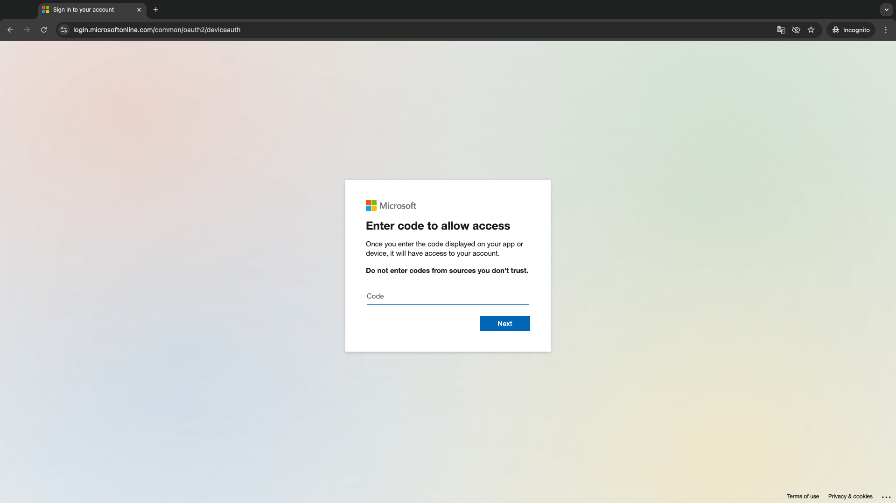

# Outlook Mailbot Tool

## Motivation and Objective

According to the [Microsoft support page](https://support.microsoft.com/en-us/office/modern-authentication-methods-now-needed-to-continue-syncing-outlook-email-in-non-microsoft-email-apps-c5d65390-9676-4763-b41f-d7986499a90d). The basic auth will be no longer available. You will receive many failures recently like me.

> September 16th, 2024 
>
> - Basic Authentication no longer available to access any Outlook account

So this is the core motivation to do the migration.

The objective of this project is to fetch and send emails with a **personal** `@outlook.com` account in a Python CLI app.

This is introducing how to use the [Modern Authentication](https://support.microsoft.com/en-us/office/modern-authentication-methods-now-needed-to-continue-syncing-outlook-email-in-non-microsoft-email-apps-c5d65390-9676-4763-b41f-d7986499a90d) rather than username/password. And using the `msal` for authentication, `imaplib` and `smtplib` for fetching and sending emails that you're familiar with.

You can find the IMAP and SMTP server on [this page](https://support.microsoft.com/en-us/office/pop-imap-and-smtp-settings-for-outlook-com-d088b986-291d-42b8-9564-9c414e2aa040). 

> Don't check out other MS docs e.g. Microsoft Graph, they don't provide any useful messages for you.
>
> LOL.

## The Implementation

Here I use the [device_code_flow](https://learn.microsoft.com/en-us/entra/identity-platform/v2-oauth2-device-code) to authenticate and get `access_token`, then used in the `imaplib` and `smtplib` api callings.

And it also provides [token cache](https://learn.microsoft.com/en-us/python/api/msal/msal.token_cache.serializabletokencache?view=msal-py-latest). So you don't need to login every time.

Example output:

```sh
(ohoutlook) outlook-bot-tool[main*] % python mailbot.py
INFO:root:🔐 Token acquired from cache
====================================================================================================
Subject: New app(s) connected to your Microsoft account
From: Microsoft account team
        <account-security-noreply@accountprotection.microsoft.com>
Date: Wed, 21 Aug 2024 21:21:03 -0700
====================================================================================================
Subject: New app(s) connected to your Microsoft account
From: Microsoft account team
        <account-security-noreply@accountprotection.microsoft.com>
Date: Wed, 21 Aug 2024 21:26:32 -0700
```

And:

```sh
(ohoutlook) outlook-bot-tool[main*] % python mailbot.py
INFO:root:No accounts found in cache
INFO:root:🔑 Device code flow initiated
To sign in, use a web browser to open the page https://microsoft.com/devicelogin and enter the code IQA3Y48WV to authenticate.

----------------------------------------------------
Open: https://microsoft.com/devicelogin
Code: IQA3Y48WV
----------------------------------------------------

INFO:root:🔐 Token acquired from remote
Email sent
```

## Step by step guides

You can follow this guide to build your own bot.

### Create a Microsoft Entra application


1. Open the [Microsoft Entra admin center](https://entra.microsoft.com/) and login using your personal account.
2. Make sure you're under the `Default Directory`. You can switch it from the dropdown list at the top right corner.
3. From the left-hand navigation, expand **Identity**, expand **Applications**, then select **App registrations**.
4. Click **+ New registration**. Enter a name for your application.
5. Choose the **Accounts in any organizational directory (Any Microsoft Entra ID tenant - Multitenant) and personal Microsoft accounts (e.g. Skype, Xbox)** account type.
6. Leave **Redirect URI** empty.
7. Click **Register** button. On the application's **Overview** page, copy the value of the **Application (client) ID** and save it.
8. Select **Authentication** under **Manage**. Locate the **Advanced settings** section and change the **Allow public client flows** toggle to **Yes**, then choose **Save**.

### Update Entra app permissions

1. On the application's page. Select **API permissions** under **Manage**.
2. Click **+ Add a permission**. Select **Microsoft Graph** from the API list.
3. Select **Delegated permissions**. You'll see a list of permissions. Use search to filter the results. Check the following:
   1. IMAP.AccessAsUser.All
   2. SMTP.Send
   3. offline_access
4. Then click **Add permissions** button to save.

### Clone this project

or you can create your own.

#### Create a Python env by conda

```sh
conda create -n ohoutlook python-dotenv msal
conda activate ohoutlook
```

Then run `python mailbot.py` to see the demo.

## The Workflow

Here I provide a file `outlook_auth.py`. You can use it in your own code like this:

```python
from outlook_auth import auth_device_flow
```

Then you can simply to get the `access_token` even from the local file cache or from remote server:

```python
access_token = auth_device_flow()

imap_conn = imaplib.IMAP4_SSL(imap_server, imap_port)
imap_conn.authenticate(
    "XOAUTH2", lambda x: f"user={user_email}\1auth=Bearer {access_token}\1\1"
)
...
smtp_conn = smtplib.SMTP(
    os.getenv("OUTLOOK_SMTP_SERVER"), os.getenv("OUTLOOK_SMTP_PORT")
)
smtp_conn.starttls()
smtp_conn.ehlo()
smtp_conn.auth(
    "XOAUTH2",
    lambda: f"user={me_mail}\1auth=Bearer {access_token}\1\1",
)
```

### Note on the device code flow

When you see this message in your output:

```sh
----------------------------------------------------
Open: https://microsoft.com/devicelogin
Code: IQA3Y48WV
----------------------------------------------------
```

You need to open the page and follow the form to enter the code. 



When done. You'll see the output keeps going. And the token is cached to local file `token_cache.json` alongside your script. It'll retrieve from the cache next time.

## Resources

Office/Exchange Doc: [Authenticate an IMAP, POP or SMTP connection using OAuth](https://learn.microsoft.com/en-us/exchange/client-developer/legacy-protocols/how-to-authenticate-an-imap-pop-smtp-application-by-using-oauth)

